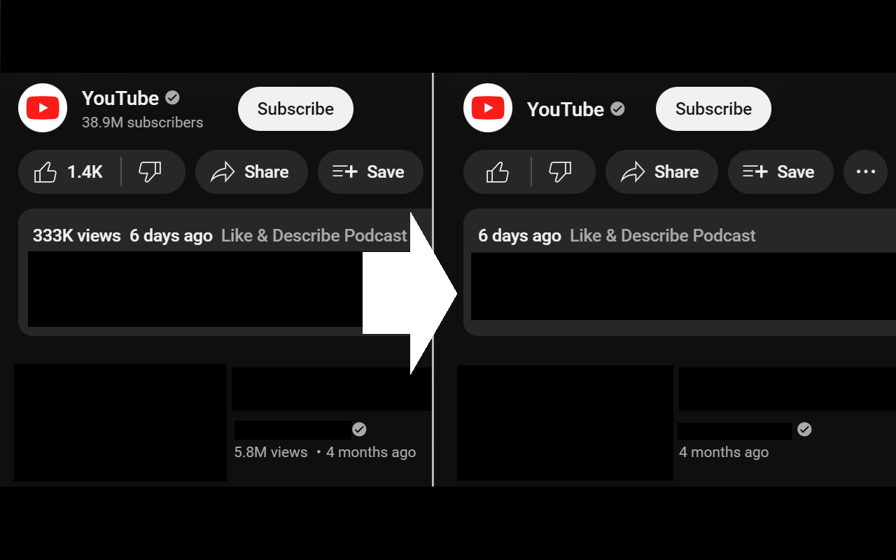

# Hide YouTube Numbers

This is a Web Extension for Chrome and Firefox that hides various numbers displayed on YouTube, such as the number of views, likes, and channel subscribers.

- [Install on Chrome](https://chromewebstore.google.com/detail/hide-youtube-numbers/joboadjmcbnnneggpohpnmkblmmjiehh)
- [Install on Firefox](https://addons.mozilla.org/ja/firefox/addon/hide-youtube-numbers/)

  

